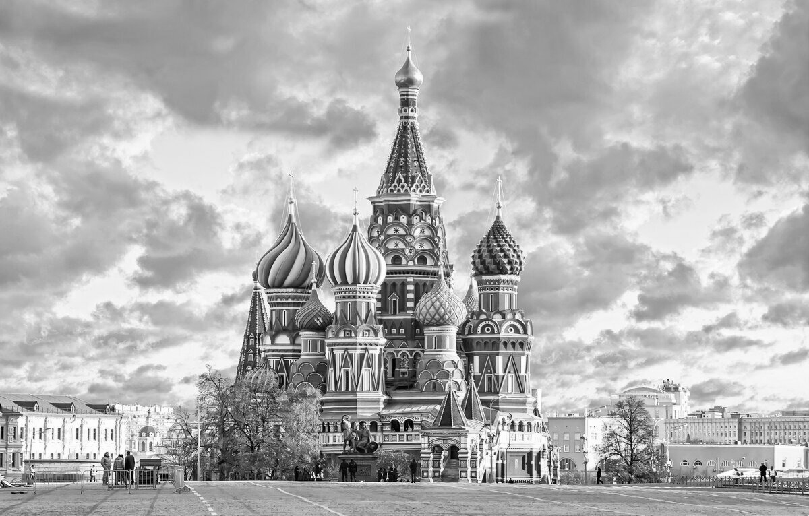
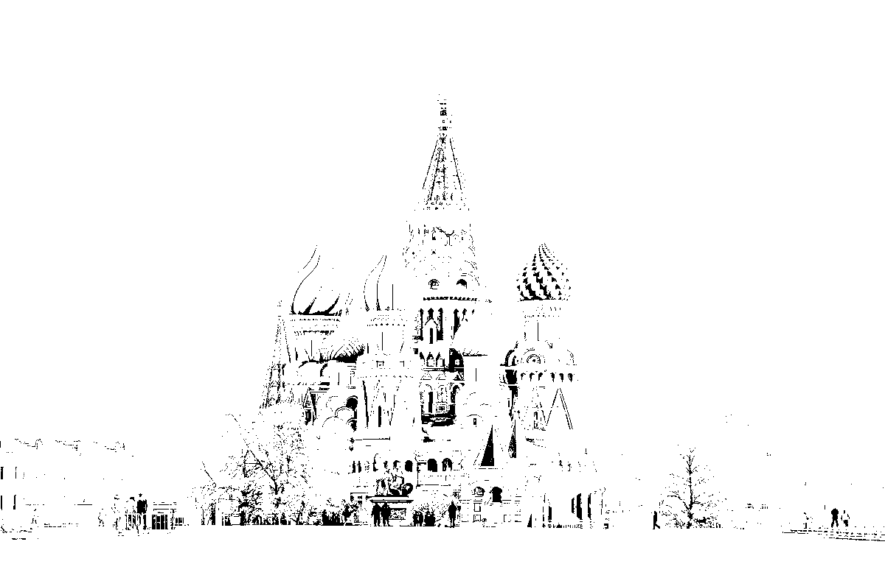
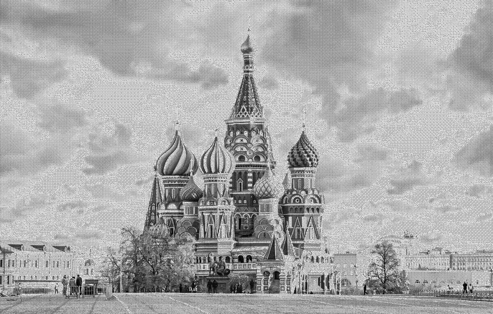
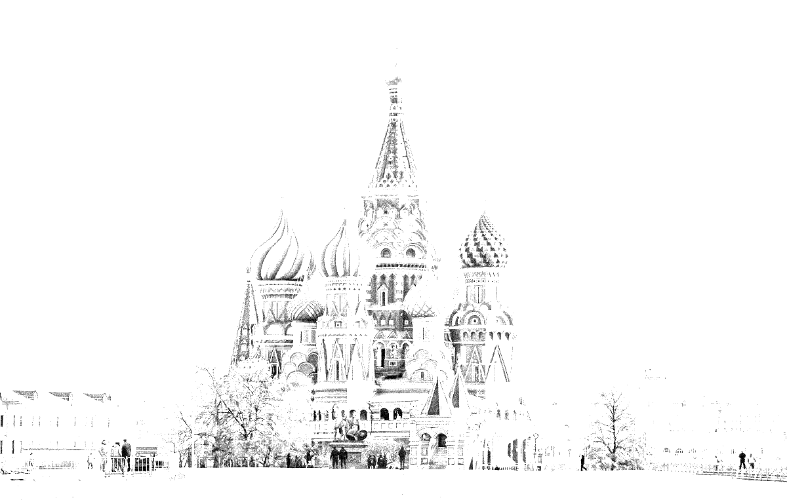
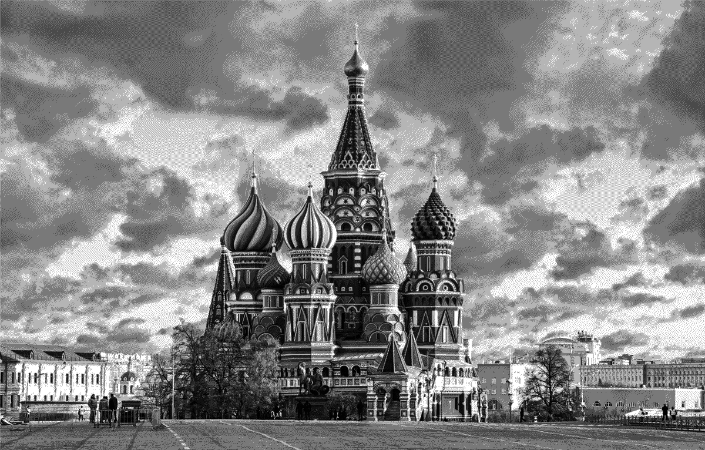
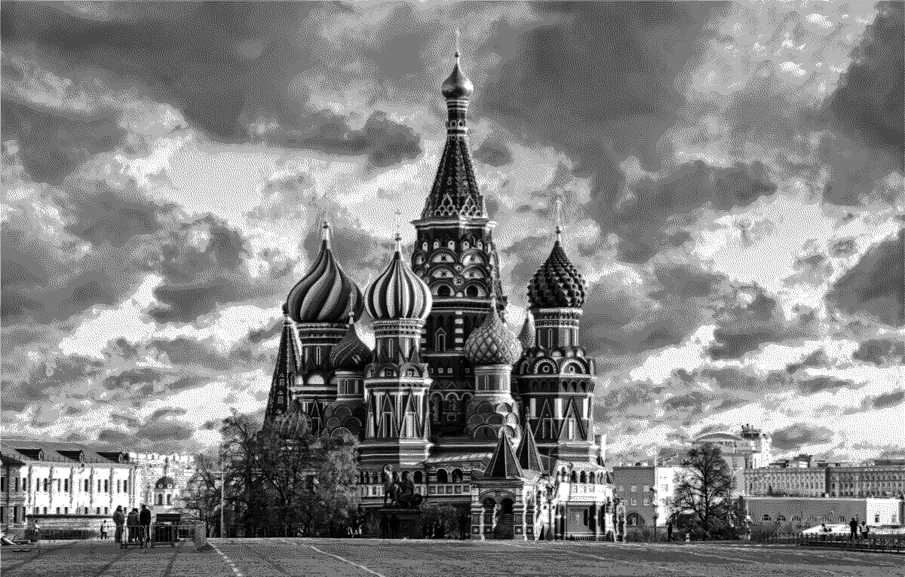
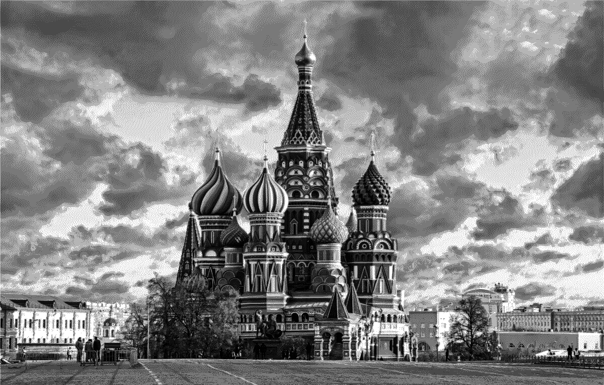
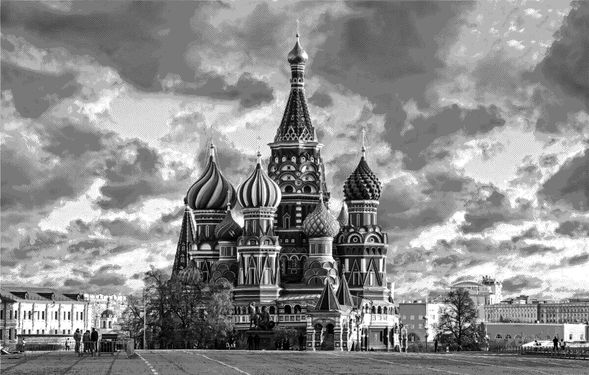
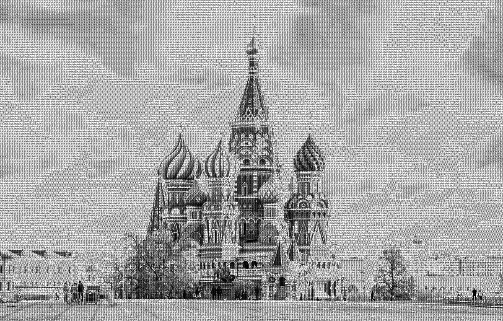

# Dithering images
```
Arguments in through the command line:
lab#.exe <name_of_input_file> <name_of_output_file> <gradient> <dithering> <bitRate> <Gamma> 
Where <option> is:
<gradient>: 0 - using input image, 1 - draw horizontal gradient (0-255)
<dithering> - Algorithm of dither:
0 – None;
1 – Ordered (8x8);
2 – Random;
3 – Floyd–Steinberg;
4 – Jarvis, Judice, Ninke;
5 - Sierra (Sierra-3);
6 - Atkinson;
7 - Halftone (4x4, orthogonal);
<bitRate> - bitRate of dith result (1..8);
<gamma>: 0 - sRGB gamma, otherwise - common gamma with set value.
```
 ### Default

# Changed images
  ### None
    
  ### Ordered (8x8)
    
  ### Random
    
  ### Floyd–Steinberg
    
  ### Jarvis, Judice, Ninke
    
  ### Sierra (Sierra-3)
    
  ### Atkinson
    
  ### Halftone (4x4, orthogonal)
    
